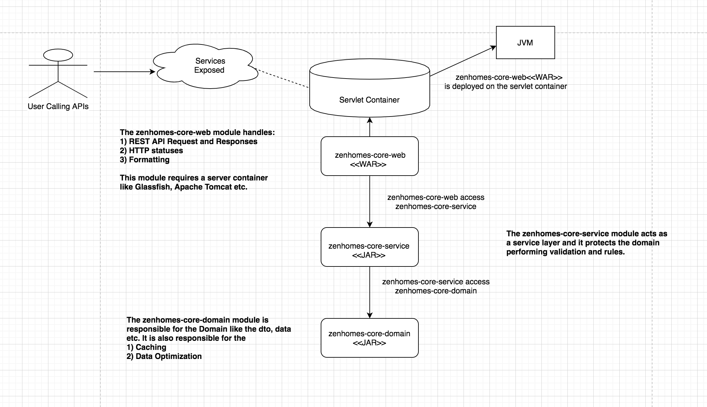
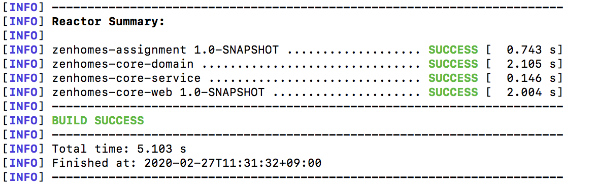
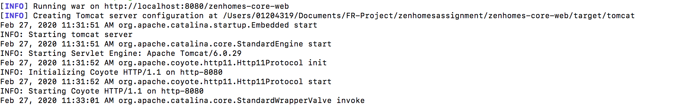
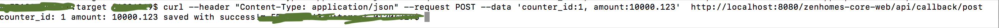
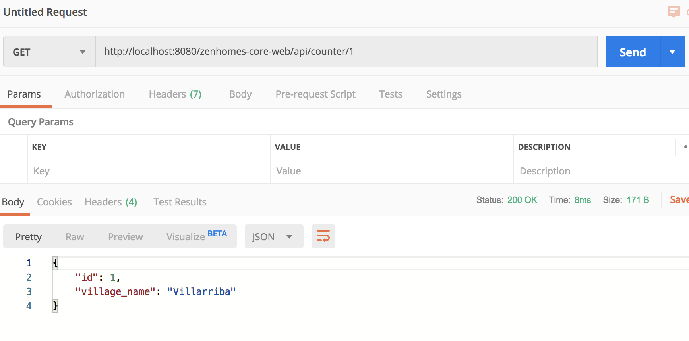
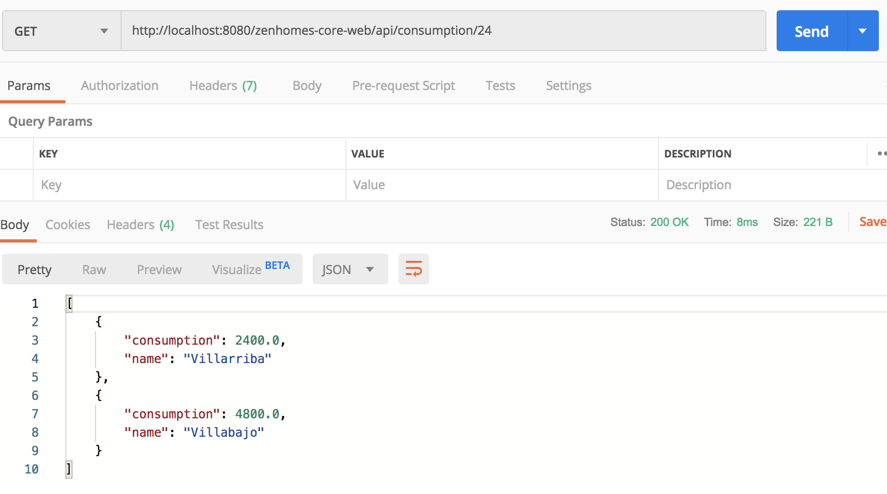

# zenhomesassignment

## coding-zenhomes ##

## Task 2: Architecture And Coding ##

### Repository name: coding-zenhomes ###

You have to design and build the system that allows to receive and collect data about energy consumption from different villages. As a result, your system should, on demand, give out the consumption report per village for the last 24h. As a result of your work, we expect the end-to-end design of the system (a model, system architecture, technology, and frameworks choice, testing strategy, etc.). We would also like to see your code for the whole system or reasonable part of it. Since our main programming language is Java, it would be nice if you implement this solution using it. 
However, if you have a project (with a task of similar complexity), then you can share it with us as well, instead of coding this task. In this case please create a statement/document explaining the problem that is being solved with it, this project should speaks for your code skills :-).

Consider that your system has an API that is called by electricity counters: 

POST /counter_callback 
{
    "counter_id": "1",
    "amount": 10000.123
} 

To get information additional information about the counter you have to call the following external API: 

GET /counter?id=1 
{
    "id": "1",
    "village_name": "Villarriba"
}

As a result, it's expected that your system will expose the following API: 

GET /consumption_report?duration=24h 
{
    "villages": [
        {
            "village_name": "Villarriba",
            "consumption": 12345.123
        },
        {
            "village_name": "Villabajo",
            "consumption": 23456.123
        }
    ]
}

#### Architecture ####

The different components involved are depicted in the above architecture. The purpose of having such modularity is to segregate the data layer (zenhomes-core-domain), service layer(zenhomes-core-service) and the deployment layer(zenhomes-core-web) such that there is less dependency between the different modules. 

* zenhomes-core-domain(JAR) : This module acts as the Data layer : Dto etc.
* zenhomes-core-service(JAR) : This module handles the calculations and Business Logic manipulations
* zenhomes-core-web(WAR): Requires serverlet container for deployment

#### Technology-Stack ####

* Java (JVM)
* IntelliJ
* Maven - For Project Management
* Apache Tomcat - Server Container
* Eclipse Jersey - Eclipse Jersey is a REST framework that provides a JAX-RS 

#### Testing Framework ####

**JUnit5**

#### Build Success ####

**Build Command** : **mvn clean install**

#### Deployment ####

**Deployment Command** : **mvn tomcat:run**
**Directory** : **/webapp**

The Maven start the Apache Tomcat container and put the application in webapps dir.

#### Test Case ####

To test the application use the following steps:

1. **POST /counter_callback { "counter_id": "1", "amount": 10000.123 }**

curl --header "Content-Type: application/json" --request POST --data 'counter_id:1, amount:10000.123' http://localhost:8080/zenhomes-core-web/api/callback/post

2. **GET /counter?id=1 { "id": "1", "village_name": "Villarriba" }**

3. **GET /consumption_report?duration=24h { "villages": [ { "village_name": "Villarriba", "consumption": 12345.123 }, { "village_name": "Villabajo", "consumption": 23456.123 } ] }**

